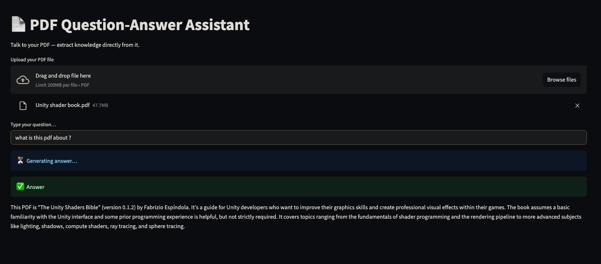
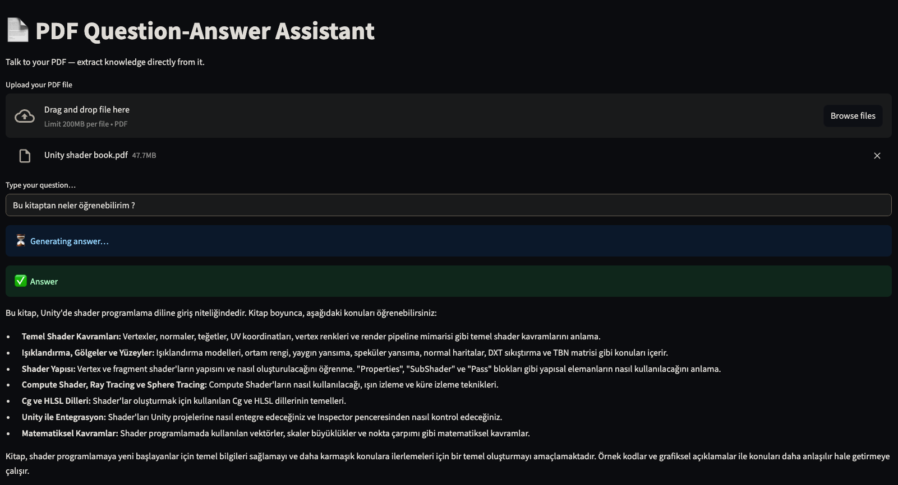
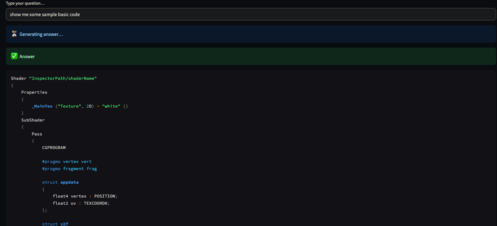

# PDF Question-Answering Assistant

This project implements a Streamlit web application that allows users to upload PDF documents and ask questions about their content. It leverages Google's Gemini Pro model via the `google-generativeai` library to understand the context from the PDF and generate relevant answers.

## Features

*   **PDF Upload:** Easily upload PDF files through the Streamlit interface.
*   **Question Answering:** Ask natural language questions about the content of the uploaded PDF.
*   **Contextual Answers:** Utilizes Google Gemini Pro to generate answers based *only* on the information present in the PDF.
*   **Efficient Text Processing:**
    *   Uses `PyPDF2` to extract text from PDF pages.
    *   Employs `tiktoken` and `langchain.text_splitter.TokenTextSplitter` for intelligent, token-aware text chunking to handle large documents effectively.
*   **Semantic Search:**
    *   Generates embeddings for text chunks using `sentence-transformers/all-MiniLM-L6-v2` via `langchain_community.embeddings.HuggingFaceEmbeddings`.
    *   Stores and searches embeddings efficiently using `FAISS`, a library for efficient similarity search.
*   **Dockerized:** Includes a `Dockerfile` for easy containerization and deployment.

## How It Works

1.  **Upload:** The user uploads a PDF file via the Streamlit interface.
2.  **Text Extraction:** The application extracts text content from each page of the PDF using `PyPDF2`.
3.  **Text Chunking:** The extracted text is split into smaller, overlapping chunks using a token-based strategy (`TokenTextSplitter`). This ensures that semantic context is preserved across chunk boundaries and respects model token limits. The chunk size is dynamically adjusted based on the total number of tokens.
4.  **Embedding:** Each text chunk is converted into a numerical vector (embedding) using the `all-MiniLM-L6-v2` sentence transformer model. These embeddings capture the semantic meaning of the text.
5.  **Vector Store:** The embeddings and their corresponding text chunks are stored in a FAISS vector store, which allows for fast similarity searches.
6.  **Question & Search:** When the user asks a question, the application generates an embedding for the question and uses FAISS to find the most relevant text chunks from the PDF based on semantic similarity.
7.  **Contextual Prompting:** The relevant text chunks are combined with the user's question into a prompt for the Google Gemini model. The prompt explicitly instructs the model to answer based *only* on the provided context.
8.  **Answer Generation:** The Gemini model processes the prompt and generates an answer based on the retrieved context.
9.  **Display:** The generated answer is displayed to the user in the Streamlit interface.

## Prerequisites

*   Python 3.9+
*   Pip (Python package installer)
*   Docker (Optional, for containerized deployment)
*   Google Gemini API Key

## Installation

1.  **Clone the Repository:**
    ```bash
    git clone <your-repository-url>
    cd pdfchatai
    ```

2.  **Install Dependencies:**
    It's recommended to use a virtual environment:
    ```bash
    python -m venv venv
    source venv/bin/activate  # On Windows use `venv\Scripts\activate`
    ```
    Install the required packages using `pip` and the `pyproject.toml` file:
    ```bash
    pip install .
    ```
    Alternatively, if you create a `requirements.txt` file, you can use:
    ```bash
    pip install -r requirements.txt
    ```

## Environment Variables

The application requires a Google Gemini API key.

1.  Create a file named `.env` in the root directory of the project (`/Users/namnam/PycharmProjects/pdfchatai/.env`).
2.  Add your Google API key to the `.env` file:
    ```dotenv
    GOOGLE_API_KEY="...YOUR_API_KEY..."
    ```
3.  You can obtain an API key from [Google AI Studio](https://aistudio.google.com/app/apikey).

**Important:** The `.env` file is included in the `.gitignore` file to prevent accidentally committing your secret API key to version control.

## Running the Application

### Locally

https://daretny-pdfchatai-main-bl4cws.streamlit.app/

### Using Docker

1.  **Build the Docker Image:**
    Make sure Docker Desktop or Docker Engine is running. Navigate to the project's root directory in your terminal.
    ```bash
    docker build -t pdfchatai .
    ```

2.  **Run the Docker Container:**
    You need to pass the `GOOGLE_API_KEY` as an environment variable to the container during runtime.
    ```bash
    docker run -p 8501:8501 -e GOOGLE_API_KEY="AIzaSy...YOUR_API_KEY..." --name pdf-qa-app pdfchatai
    ```
    *   `-p 8501:8501`: Maps port 8501 on your host machine to port 8501 inside the container.
    *   `-e GOOGLE_API_KEY="..."`: Sets the environment variable inside the container. **Replace `"AIzaSy...YOUR_API_KEY..."` with your actual API key.**
    *   `--name pdf-qa-app`: Assigns a name to the running container (optional).
    *   `pdfchatai`: The name of the image to run.

    The application will be accessible at `http://localhost:8501`.

## Technologies Used

*   **Backend:** Python
*   **Web Framework:** Streamlit
*   **LLM:** Google Gemini Pro (`google-generativeai`)
*   **Text Processing & Orchestration:** LangChain (`langchain`, `langchain-community`)
*   **PDF Parsing:** PyPDF2
*   **Text Splitting:** Tiktoken, LangChain TokenTextSplitter
*   **Embeddings:** Sentence Transformers (`sentence-transformers`), HuggingFaceEmbeddings (`langchain_community`)
*   **Vector Database:** FAISS (`faiss-cpu`)
*   **Dependency Management:** Pip, `pyproject.toml`
*   **Containerization:** Docker

## Potential Improvements

*   **Error Handling:** More robust error handling for PDF parsing and API calls.
*   **Caching:** Implement caching for embeddings to speed up processing for previously seen PDFs.
*   **Asynchronous Processing:** Handle PDF processing and API calls asynchronously for a more responsive UI, especially for large files.
*   **Chat History:** Maintain a conversation history for follow-up questions.
*   **Alternative Embedders/LLMs:** Allow selection of different embedding models or LLMs.
*   **GPU Support:** Configure `faiss-gpu` and necessary CUDA dependencies in Docker for faster FAISS indexing/search on compatible hardware.
*   **Deployment:** Instructions for deploying to cloud platforms (e.g., Streamlit Community Cloud, Hugging Face Spaces, AWS, GCP, Azure).

## İmages


---

---


## License

Consider adding a `LICENSE` file (e.g., MIT, Apache 2.0) if you plan to share this project publicly.
